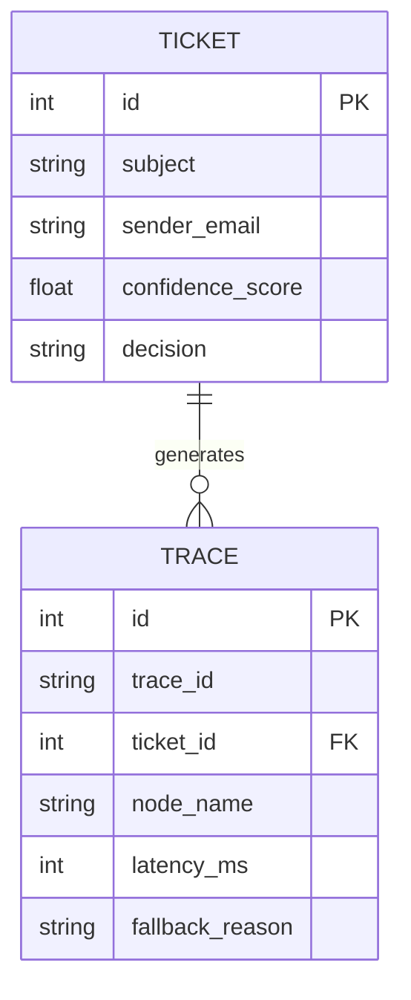
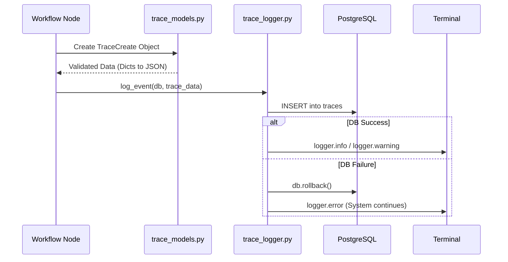
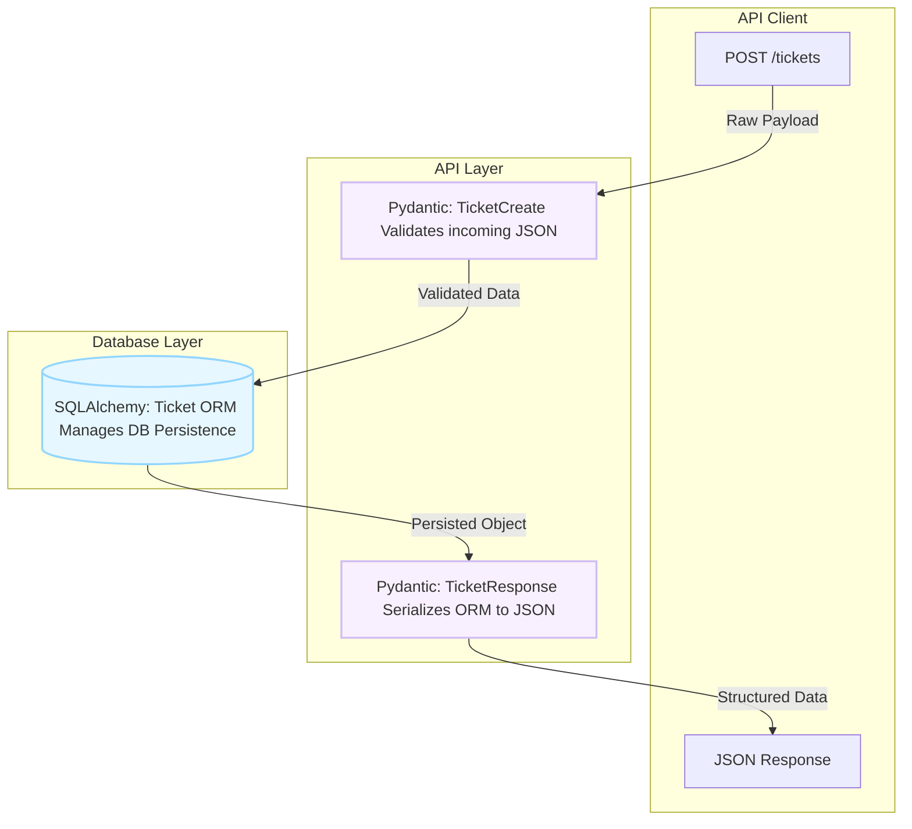
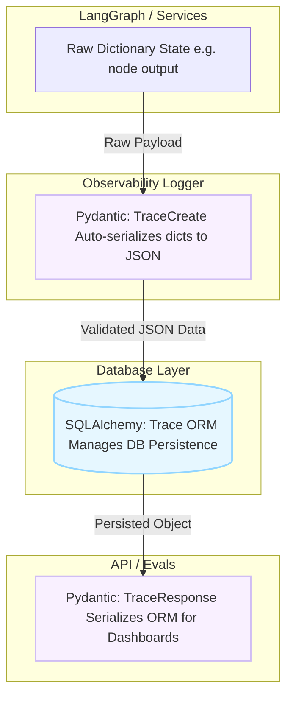

# LumenFlow Architecture Decisions (Backend Phase 1)

This document defines the canonical engineering architecture for LumenFlow after the initial structural hardening of the Database, Configuration, and Observability layers (Steps 1 to 5). 

This reflects the production-aligned, vertical execution strategy designed to guarantee fail-fast stability before the introduction of complex LLM orchestration.

---

# 1. Core Configuration Layer (app/core/)

## 1.1 `config.py`

### Architectural Role
The configuration layer provides centralized, type-safe environment management using Pydantic `BaseSettings`. 

### Design Principles
- **No Hardcoded Secrets**: All credentials (e.g., `GROQ_API_KEY`, `POSTGRES_PASSWORD`) are dynamically loaded from a `.env` file.
- **Dynamic URI Construction**: The `SQLALCHEMY_DATABASE_URI` is constructed via a `@property` method to guarantee the connection string always reflects the latest environment variables.
- **Fail-Fast Initialization**: If required environment variables are missing or malformed, Pydantic raises a validation error immediately on application startup, preventing silent failures downstream.

---

# 2. Database Layer (app/db/)

The database layer uses SQLAlchemy 2.0 to enforce strict schema boundaries.

## 2.1 Connection Management (`session.py` & `base.py`)

- **`base.py`**: Establishes the modern SQLAlchemy 2.0 `DeclarativeBase` which acts as the foundation for all ORM models.
- **`session.py`**: Initializes the engine with `pool_pre_ping=True` (to gracefully handle database disconnects) and `echo=True` (for diagnostic SQL query logging during early development). 

## 2.2 Relational Models (`models/`)

### `ticket.py`
The `Ticket` model uses SQLAlchemy 2.0 `Mapped` columns for strict type enforcement. 
It captures both the raw inputs (`subject`, `body`, `sender_email`) and the outputs of the future AI pipeline (`confidence_score`, `decision`, `category`).

### `trace.py`
The `Trace` model is strictly bounded to prevent enterprise bloat. 
- It captures `trace_id`, `node_name`, `latency_ms`, and `prompt_version`.
- **Critical Decision**: The inclusion of `fallback_reason` and `error_message` ensures that degraded system modes are explicitly recorded for offline evaluation.

---

# 3. Validation Schema Layer (app/schemas/)

Pydantic schemas enforce structural validation on all data entering or exiting the backend. 

## 3.1 `ticket.py`
Defines `TicketBase`, `TicketCreate`, and `TicketResponse`. 
- **Strict Typing**: Utilizes `EmailStr` from `email-validator` to guarantee that malformed sender addresses are rejected before they touch the database.
- **ORM Compatibility**: `model_config = ConfigDict(from_attributes=True)` ensures seamless serialization from SQLAlchemy models to JSON responses.

## 3.2 AI Output Schemas (`classification.py` & `retrieval.py`)
- **`ClassificationResult`**: Enforces that the LLM must return a `category`, `priority`, and `confidence` score. 
- **`RetrievedDocument`**: Enforces that the retrieval engine must return a `source_id`, `content`, and `similarity_score`. 
- **Philosophy**: By defining these schemas *before* the reasoning engines are built, we guarantee that the LLM's probabilistic generation is forced into a deterministic, programmatic contract. 

---

# 4. Observability Layer (app/observability/)

The observability layer is prioritized before AI orchestration to guarantee that every system action is traceable from Day 1.

## 4.1 Schema Contract (`trace_models.py`)

### Architectural Role
Acts as a strict validation layer for trace data before it is persisted.

### Design Principles
- **Automatic Serialization**: A smart `@field_validator` intercepts Python dictionaries (e.g., raw LangGraph state payloads) and automatically serializes them into JSON strings via `json.dumps`. This prevents database insertion errors when writing to PostgreSQL `Text` columns.

## 4.2 Logging Engine (`trace_logger.py`)

### Execution Flow
1. Receives a validated `TraceCreate` object.
2. Maps it to the SQLAlchemy `Trace` model and commits to PostgreSQL.
3. Outputs structured terminal logs (Info, Warning, Error).
4. Appends a raw JSON representation to `evals/traces.jsonl` for offline evaluation scripts.

### Fail-Safe Architecture
The database transaction is wrapped in a `try...except` block with an explicit `db.rollback()`.
- **Why?**: Observability failures must **never** crash the main business logic pipeline. If the database drops the trace, the system logs the error to `stdout` but allows the core workflow to proceed.

---

# 5. Application Entrypoint (app/main.py)

## 5.1 FastAPI Initialization
The `main.py` file exposes the core application.
- Uses `Base.metadata.create_all(bind=engine)` to automagically initialize the PostgreSQL schema based on our ORM models.
- Exposes a minimal `GET /health` endpoint.

### Purpose
This establishes the foundational "Fail-Fast" milestone. Before any complex LangGraph loops are built, this layer proves that the Docker container, FastAPI application, and PostgreSQL database are communicating deterministically.

---

# 6. Architectural Separation Philosophy

LumenFlow intentionally separates:
- SQLAlchemy ORM models
- Pydantic validation schemas
- Observability contracts
- Service orchestration logic

...even when some structures appear superficially similar.

### Why This Matters
ORM models represent database persistence concerns, while Pydantic schemas represent runtime validation and API serialization contracts.

This strict separation guarantees:
- Deterministic validation before persistence.
- Clean API boundaries.
- Safer AI output handling.
- Easier testing and replayability.
- Decoupled business and infrastructure concerns.

### Example in Action: Ticket Flow
The diagram below illustrates exactly when `TicketBase`, `TicketCreate`, and `TicketResponse` come into play across the pipeline, ensuring that raw incoming data, persisted DB data, and outgoing API data are strictly validated at each transition.

* **`TicketCreate`**: Comes into play at **Step 5 (and future API endpoints)** when the API receives raw data. It ensures data (like `sender_email`) is valid before it ever reaches the database logic.
* **`Ticket ORM Model`**: Comes into play at **Step 3**, acting as the persistence mapping layer.
* **`TicketResponse`**: Comes into play when sending data back to the frontend. It safely converts complex SQLAlchemy objects (with metadata like `id` and `created_at`) into a clean dictionary.

### Example in Action: Trace Flow
Similarly, the Trace flow strictly separates runtime observability payloads from database insertion.

* **`TraceCreate`**: Comes into play at **Step 4** inside `trace_logger.py`. It intercepts raw dictionaries from LangGraph nodes and validates/serializes them into strings for the DB.
* **`Trace ORM Model`**: Comes into play at **Step 3**, acting as the persistence mapping layer for traces.
* **`TraceResponse`**: Comes into play when fetching traces for the UI dashboard or evaluation harness, ensuring sensitive internal ORM state is cleanly structured before transmission.

This strict architectural separation prevents logic drift and guarantees that as our workflow graph and evaluation suite scale, our persistence layer remains entirely uncoupled from our runtime state layer.

---

# Summary of Implementation Quality (Steps 1-5)
The backend architecture is currently:
- **Structurally isolated**: Configuration, database, schemas, and logging are fully decoupled.
- **Validation-driven**: Pydantic intercepts and validates all data flows.
- **Fail-safe**: Logging cannot crash the system.